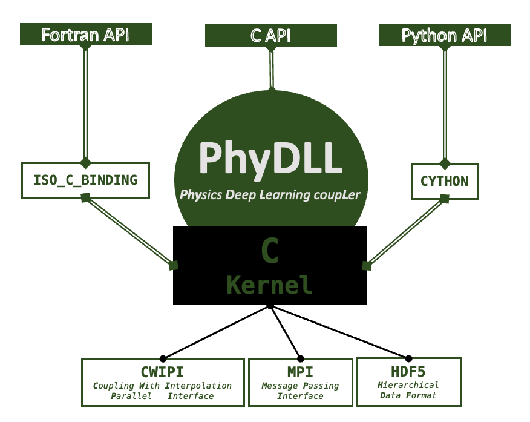

.. _header-n0:

.. documentation master file

Welcome to PhyDLL!
===================================

**PhyDLL** (fidɛl) (**Phy**\ sics **D**\ eep **L**\ earning coup\ **L**\ er) is an open-source library to couple massively parallel physical solvers to distributed deep learning inference.

.. note::

   This project is under active development.

.. toctree::
   :maxdepth: 3

   redirect.rst
   changelog_copy.md

PhyDLL's Python documentation
=============================

   * :ref:`genindex`
   * :ref:`modindex`
   * :ref:`search`
