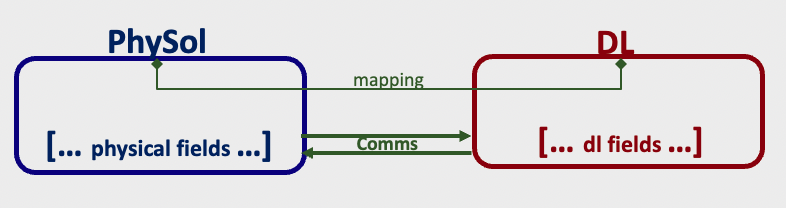

# C-C non-context aware coupling
**Note:** In this tutorial, `$PHYDLL` stands for the build repository of PhyDLL.

This tutorial shows how to couple a physical solver (`C`) to a deep learning engine (`C`). PhyDLL performs a non-context aware coupling. It means that exchanged data does not have a topology structure. Hence, the definition of the coupling does require any mesh information.



This tutorial is available in [`test/t0_nc/`](https://gitlab.com/cerfacs/phydll/-/tree/release/0.2/test/t0_nc) and it contains
+ [`phy_main.c`](https://gitlab.com/cerfacs/phydll/-/tree/release/0.2/test/t0_nc/phy_main.c) which represents the physical solver.
+ [`dl_main.c`](https://gitlab.com/cerfacs/phydll/-/tree/release/0.2/test/t0_nc/dl_main.c) which is a DL engine with dummy prediction.

### Running steps:
#### 1. Compile PhyDLL
PhyDLL should be installed as described in [PhyDLL#install](https://gitlab.com/cerfacs/phydll/-/tree/release/0.2/doc/phydll/install.md). For this tutorial, HDF5 support is not required.

#### 2. Compile tutorial
```bash
mpicc ./phy_main.c -o ./phy.exe -I$(PHYDLL)/include -L$(PHYDLL)/lib -lphydll -Wl,-rpath=$(PHYDLL)/lib
mpicc ./dl_main.c -o ./dl.exe -I$(PHYDLL)/include -L$(PHYDLL)/lib -lphydll -Wl,-rpath=-L$(PHYDLL)/lib
```

#### 3. Generate jobscript and run
The job script generator [`scripts/jobscript_generator.py`](https://gitlab.com/cerfacs/phydll/-/tree/release/0.2/scripts/jobscript_generator.py) is highly recommended to create a slurm script to run the coupling. After the script is generated, the job could be submitted with `sbatch`.

The description of the subroutines used in this tutorial is available in [PhyDLL#deployment](../deployment/create.md).

### Snippets:
#### Create Physical Solver instance
+ Headers
```c
#include <mpi.h>
#include "phydll.h"

int main(int argc, char* argv[]) {
    // Init MPI
    MPI_Init(&argc, &argv);
    MPI_Comm glcomm = MPI_COMM_WORLD

    // Init phydll
    phydll_init("physical");
    MPI_Comm comm = phydll_get_local_mpi_comm();
    int hc_rank; MPI_Comm_rank(glcomm, &hc_rank);

    // Phydll options
    phydll_opt_enable_cpl_loop();
    phydll_opt_set_output_freq(2);

    // Define phydll
    int count = 3;
    int size = 5 + hc_rank;
    phydll_define_phy(count, size);

    /***
     * LOOP
    ***/
}
```
#### Create DL Engine instance
```c
#include <mpi.h>
#include "phydll.h"

int main(int argc, char* argv[]) {
    // Init MPI
    MPI_Init(&argc, &argv);
    MPI_Comm glcomm = MPI_COMM_WORLD;

    // Init phydll
    phydll_init("dl");
    MPI_Comm comm = phydll_get_local_mpi_comm();

    // Define phydll
    int count = 2;
    phydll_define_dl(count);

    /***
     * LOOP
    ***/
}
```
#### Physical Solver temporal loop
```c
    // Loop params
    int niter = 5;

   // Allocate fields
    double* phy_field_0 = (double*) malloc(size * sizeof(double));
    double* phy_field_1 = (double*) malloc(size * sizeof(double));
    double* phy_field_2 = (double*) malloc(size * sizeof(double));

    double* dl_field_0 = (double*) malloc(size * sizeof(double));
    double* dl_field_1 = (double*) malloc(size * sizeof(double));

    // Loop
    for (int iter = 1; iter <= niter; iter++) {
        // Compute physical field
        char label[64];
        for (int i = 0; i < size; i++) {
            phy_field_0[i] = hc_rank + i/10.;
            phy_field_1[i] = hc_rank + i/100.;
            phy_field_2[i] = hc_rank + i/1000.;
        }

        // Set physical field
        strcpy(label, "TUTO-PHY-FIELD000");
        phydll_set_field(&phy_field_0, label);

        strcpy(label, "TUTO-PHY-FIELD111");
        phydll_set_field(&phy_field_1, label);

        strcpy(label, "TUTO-PHY-FIELD222");
        phydll_set_field(&phy_field_2, label);

        // Send physical field
        phydll_isend();
        phydll_wait_isend();

        // Receive DL field
        phydll_recv();

        // Get DL field
        char label_0[64], label_1[64];
        phydll_get_field(&dl_field_0, label_0);
        phydll_get_field(&dl_field_1, label_1);
    }

    // Finalize phydll
    phydll_finalize();

    // Free memory
    free(phy_field_0);
    free(phy_field_1);
    free(phy_field_2);
    free(dl_field_0);
    free(dl_field_1);
```

#### DL Engine prediction loop
```c
    // Allocate fields
    double* phy_field_0;
    double* phy_field_1;
    double* phy_field_2;
    double* dl_field_0;
    double* dl_field_1;

    // Prediction loop
    while (phydll_is_phy_signal()) {
        // Receive physical field
        phydll_irecv();
        phydll_wait_irecv();

        // Get physical field
        int size;
        phydll_get_field_size(&size);

        char label_0[64], label_1[64], label_2[64];
        phydll_get_field(&phy_field_0, label_0);
        phydll_get_field(&phy_field_1, label_1);
        phydll_get_field(&phy_field_2, label_2);

        // Dumy prediction
        dl_field_0 = (double*) malloc(size * sizeof(double));
        dl_field_1 = (double*) malloc(size * sizeof(double));
        for (int i = 0; i < size; i++) {
            dl_field_0[i] = -(50 + phy_field_0[i] + phy_field_2[i]);
            dl_field_1[i] = -(80 + phy_field_1[i] + phy_field_2[i]);
        }

        // Set DL field
        char label[64];
        strcpy(label, "TUTO-DL-FIELD000");
        phydll_set_field(&dl_field_0, label);

        strcpy(label, "TUTO-DL-FIELD111");
        phydll_set_field(&dl_field_1, label);

        // Send DL field
        phydll_send();
    }

    // Finalize phydll
    phydll_finalize();

    // Free memory
    free(phy_field_0);
    free(phy_field_1);
    free(phy_field_2);
    free(dl_field_0);
    free(dl_field_1);
```